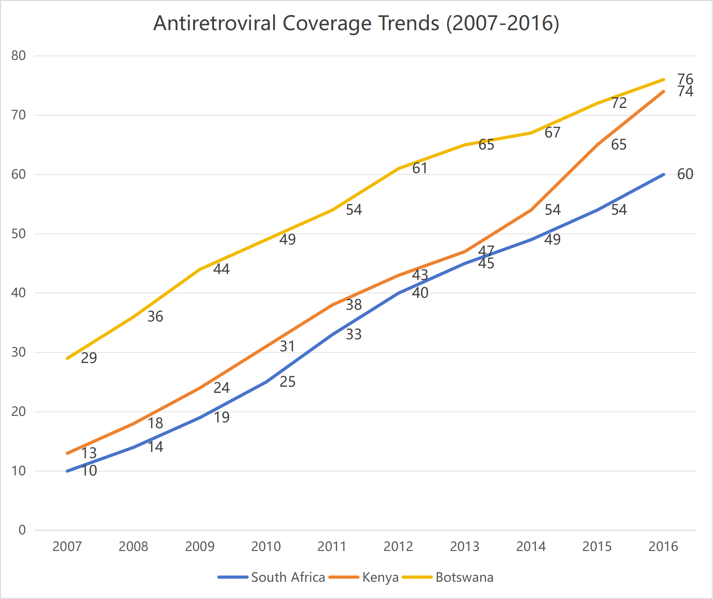
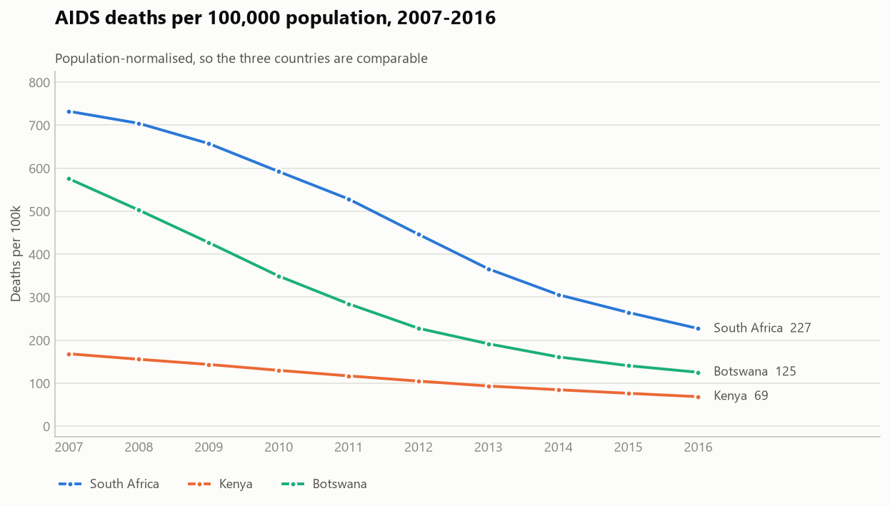
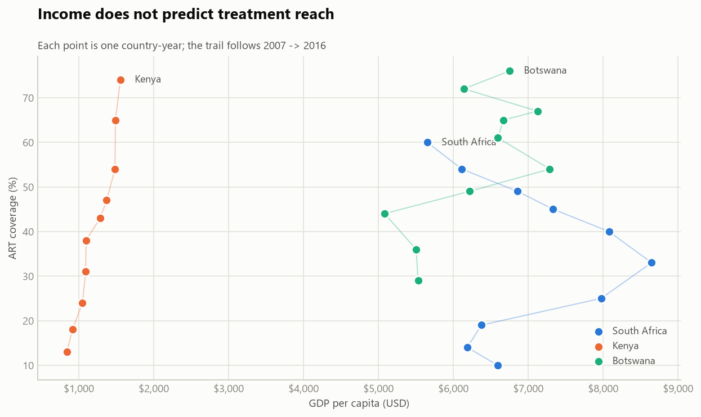

# Cross-National Public Health Data Analysis — HIV in Sub-Saharan Africa

[](https://github.com/liciazheng/cross-national-public-health-analysis/actions/workflows/ci.yml)

A comparative analysis of HIV prevalence, treatment coverage, and prevention-programme effectiveness in **South Africa, Kenya, and Botswana** from **2007 to 2016**, joined against World Bank economic indicators.

The whole pipeline is one script: it joins the raw extracts, runs data-quality checks against them, writes a cleaned dataset, and regenerates every figure below.

```bash
pip install -r requirements.txt
python analysis.py
```

## Questions

1. How did HIV prevalence change in these three countries between 2007 and 2016?
2. How far did antiretroviral therapy (ART) coverage expand?
3. How successful were Prevention of Mother-to-Child Transmission (PMTCT) programmes?
4. Does economic development predict HIV outcomes?

Sub-Saharan Africa accounts for roughly 70% of global HIV cases. These three countries span a wide range of both epidemic scale and national income, which makes them a useful comparison set: Botswana is small and relatively wealthy with a severe epidemic, Kenya is large and low-income with a milder one, South Africa is large and carries the biggest absolute burden in the world.

## Findings

### Treatment coverage expanded dramatically everywhere

ART coverage rose from 10% to 60% in South Africa, 13% to 74% in Kenya, and 29% to 76% in Botswana. It is the clearest signal in the dataset.



### Treatment tracks mortality almost perfectly

Within each country, ART coverage and AIDS deaths per 100,000 move together with a correlation of **r = −0.98 to −1.00**. Population-normalised mortality fell 69% in South Africa, 59% in Kenya, and 78% in Botswana.



A near-perfect within-country correlation over ten years is not proof of causation — both series trend monotonically, and plenty of other things improved over the same decade. But the direction and consistency across three very different health systems is what the ART literature would predict.

### Income does **not** predict treatment reach

This is the question the original analysis could not answer, and the pipeline answers it directly:

| Relationship | Pooled correlation (n = 30) |
|---|---|
| GDP per capita ~ ART coverage | **r = +0.12** |
| ART coverage ~ AIDS deaths per 100k | r = −0.59 |
| GDP per capita ~ AIDS deaths per 100k | r = +0.62 |

Income is essentially uncorrelated with treatment reach. Kenya makes the point on its own — its GDP per capita barely moved off $840–$1,554 while ART coverage went from 13% to 74%, which is why its trail below is almost vertical.



The **positive** correlation between income and mortality (r = +0.62) is a between-country artifact, not a finding: Botswana and South Africa are both richer than Kenya *and* both carry far more severe epidemics. With only three countries, national income is hopelessly confounded with epidemic severity, so that coefficient should be read as a warning about the sample size rather than a result.

### PMTCT programmes converged at a high level

By 2016 all three countries reached 87–93% coverage, from very different starting points (South Africa 49%, Kenya 57%, Botswana 78%). Reported mother-to-child transmission fell to 4% in South Africa and 5% in Botswana — though Kenya remained at 9% despite 92% coverage, which the coverage figure alone does not explain.

### Prevalence fell slowly

Kenya 6.0% → 4.5%, Botswana 23.6% → 21.4%. Prevalence is a stock, not a flow: as treatment keeps people alive longer, prevalence can stay high even while new infections and deaths fall. It is the least informative of the four indicators here, which is worth saying plainly since it was the headline measure in the original framing.

## Figures

All regenerated by `analysis.py`.

| | |
|---|---|
| [ART coverage trends](figures/art-coverage-trends.png) | [PMTCT coverage trends](figures/pmtct-coverage-trends.png) |
| [AIDS deaths (absolute, small multiples)](figures/aids-deaths.png) | [AIDS deaths per 100,000](figures/aids-deaths-per-100k.png) |
| [Adult HIV prevalence](figures/hiv-prevalence-trends.png) | [Mother-to-child transmission rate](figures/mtct-rate.png) |
| [GDP per capita](figures/gdp-per-capita.png) | [ART coverage vs GDP per capita](figures/art-coverage-vs-gdp.png) |

## Data

**Source:** [World Bank World Development Indicators](https://databank.worldbank.org/source/world-development-indicators). Ten years × three countries = 30 observations.

| File | Role |
|---|---|
| [`data/hiv_indicators.csv`](data/hiv_indicators.csv) | Raw — prevalence, ART, PMTCT, people living with HIV, AIDS deaths, women 15+ with HIV, MTCT rate |
| [`data/economic_indicators.csv`](data/economic_indicators.csv) | Raw — population, GDP, unemployment |
| [`data/joined_dataset.csv`](data/joined_dataset.csv) | The original hand-built join, kept for comparison |
| [`data/analysis_dataset.csv`](data/analysis_dataset.csv) | **Generated** — the cleaned, joined, derived dataset the figures are built from |
| `data/hiv_table*.xlsx` | Excel working files from the original pass |

Every column — units, ranges, null counts, and why each dropped column was dropped — is documented in [`data/DATA_DICTIONARY.md`](data/DATA_DICTIONARY.md).

The raw CSVs are European Excel exports — semicolon-delimited, comma decimal separator:

```python
pd.read_csv("data/hiv_indicators.csv", sep=";", decimal=",")
```

They are left exactly as collected. Every correction happens in `analysis.py`, so each one is visible, justified, and reproducible rather than baked into a file.

## Data quality

The source extracts contain real errors. Rather than fix them silently, `analysis.py` runs eight checks on every run and prints what it finds — **14 errors and 4 warnings** as of the current data. The substantive ones:

| Problem | Check that catches it | Handling |
|---|---|---|
| `GDP_per_capita` actually holds **total GDP** (South Africa 2007 = `3.33E+11` = $333bn) | magnitude vs population | renamed `gdp_usd`; true `gdp_per_capita_usd` derived |
| `People living with HIV` for Kenya and Botswana is South Africa's **2016 value (6,900,000) filled down** across all ten years | constant-series detection | dropped for both countries |
| That same column gives Botswana 6.9m people with HIV against a **population of 2.2m** | value exceeds population | dropped |
| South Africa's `HIV_Prevalence_Female` is a **verbatim copy of `PMTCT_Coverage`** (49, 63, 79, 93, 100 …) | duplicate-column detection | column dropped from the analysis set |
| `prevalence_total` sits outside the female/male range in **30/30 rows** — the three columns are not the same indicator | range coherence | female/male dropped; see note below |
| South Africa's `prevalence_total` (4.1–4.7%) is far below published adult prevalence for the period (~18%) | manual cross-reference | South Africa excluded from the prevalence figure |
| The hand-built `joined_dataset.csv` disagrees with the source extract on `people_living_with_hiv` in **30/30 rows** | cross-check against the scripted join | scripted join is authoritative |
| `mtct_rate` missing for 2007–2009 | null report | chart starts at 2010 |

On the sex-disaggregated columns: for Kenya and Botswana the female/male pairs are internally plausible (Kenya 3.6%/1.3%, Botswana 12.8%/4.5%) but sit *below* the total rather than bracketing it. That pattern is consistent with them being **youth (15–24) prevalence** against an **adult (15–49) total** — different indicators under misleading headers. Since that is inference rather than documentation, they are excluded rather than relabelled.

Every error above is the signature of a manual Excel workflow — fill-down, copy-paste into the wrong column, a header carried over from a different indicator. Doing the join in code is what makes them visible.

## Tests

```bash
pip install -r requirements.txt pytest
pytest
```

23 tests. The ones that matter are on the validator: **a data-quality check that is never tested is a check you find out about when it fails to fire**, so each of the eight is exercised twice — against synthetic data engineered to trip it, and against clean data to confirm it stays quiet.

- Every check fires on a planted fault: a filled-down constant series, a column copied over its neighbour, cases exceeding population, total GDP posing as per capita, incoherent sex-disaggregated prevalence, out-of-range coverage, and nulls.
- On the real extracts, all four known errors are asserted to be caught.
- `join()` raises rather than silently dropping rows when the keys don't match.
- Cleaning nulls the unreliable cells without inventing values, keeps South Africa's real `people_living_with_hiv` series, drops no rows, and derives the per-capita columns correctly.
- The headline numbers in this README are pinned: ART coverage endpoints per country, the r = +0.12 income/treatment correlation, and r < −0.95 within every country for treatment against mortality. If the data or the pipeline changes, the claims above break loudly.
- All eight figures render, into a temp directory so the test never touches `figures/`.

## Layout

```
analysis.py            the pipeline: load -> join -> validate -> clean -> analyse -> plot
requirements.txt
data/                  raw extracts, the original hand join, the generated dataset,
                       and DATA_DICTIONARY.md
figures/               eight charts, all regenerated by analysis.py
tests/                 23 tests, mostly on the data-quality checks
```
