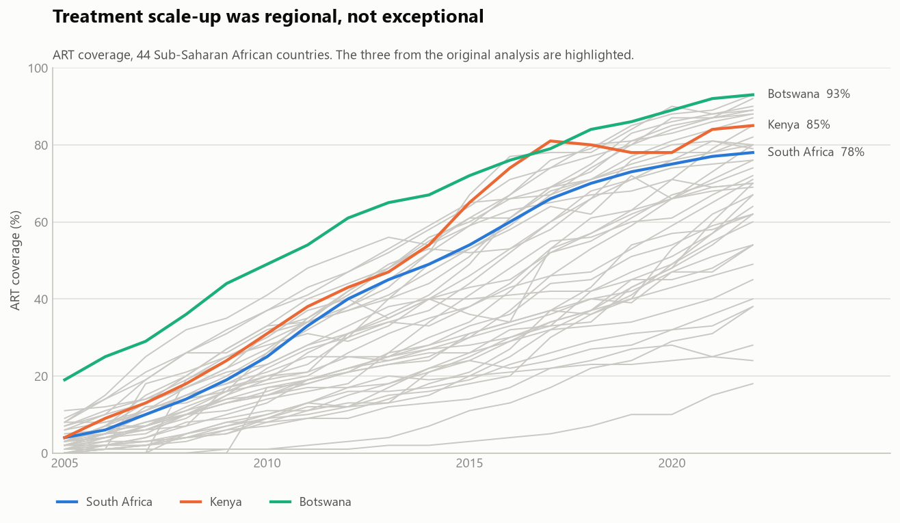
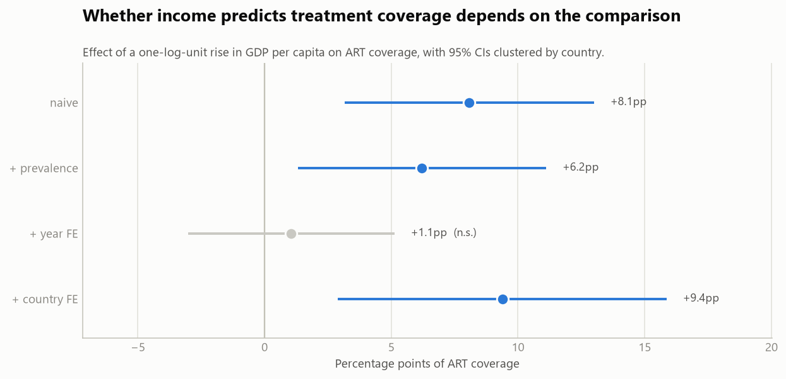
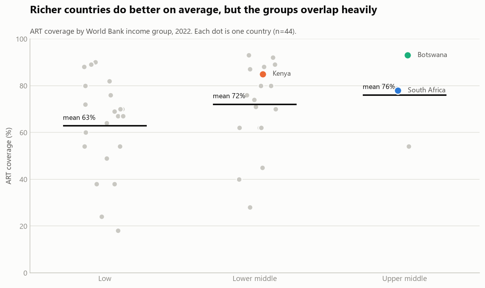
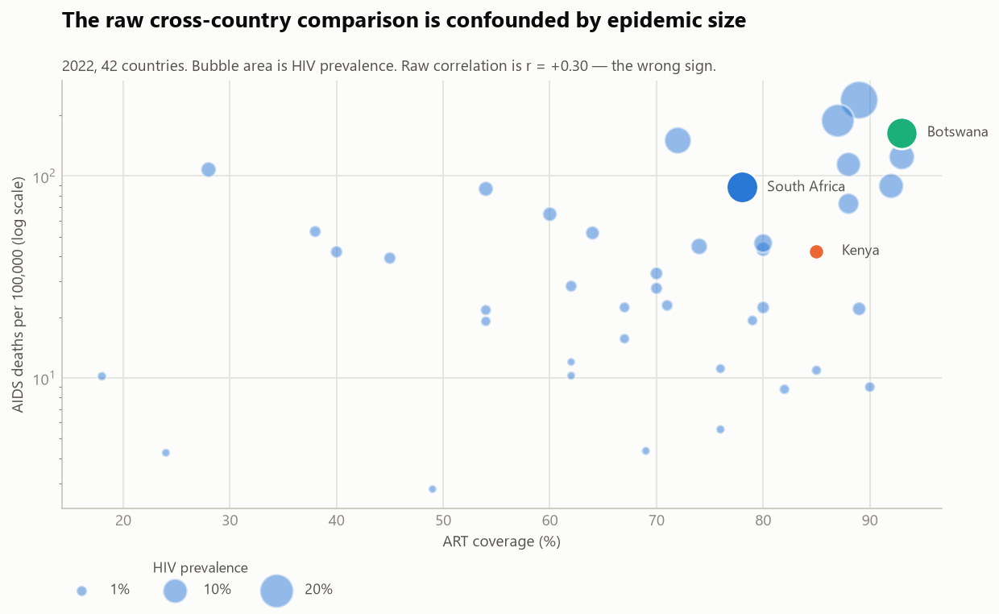
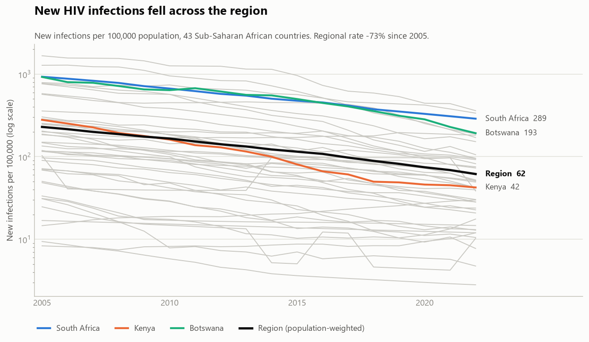
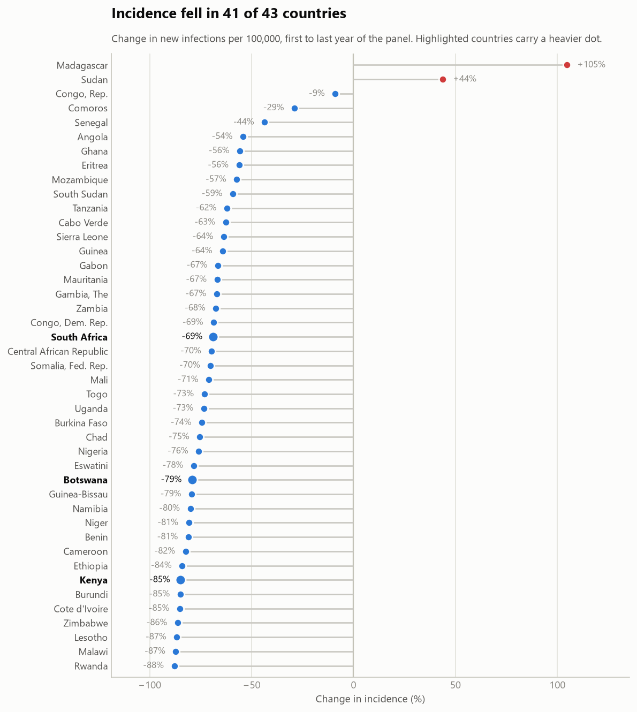

# Cross-National Public Health Data Analysis — HIV in Sub-Saharan Africa

Does economic development explain how well a country controls its HIV epidemic?

This started as a three-country comparison built on a hand-collected spreadsheet. Auditing that spreadsheet in code turned up enough errors that the honest move was to go to the primary source and redo the analysis at scale. Both halves are here, because the first half is the more useful lesson.

```bash
pip install -r requirements.txt

python analysis.py          # part 1: three countries, and the data-quality audit
python fetch_worldbank.py   # pull 48 countries from the World Bank API
python panel_analysis.py    # part 2: the panel, with regressions
```

## Part 1 — three countries, and what auditing the data found

South Africa, Kenya and Botswana, 2007–2016, from a spreadsheet assembled by hand. [`analysis.py`](analysis.py) joins the two raw extracts in code, runs eight data-quality checks, writes a cleaned dataset, and draws eight figures.

The checks report **14 errors and 4 warnings**. The substantive ones:

| Problem | Check that catches it | Handling |
|---|---|---|
| `GDP_per_capita` actually holds **total GDP** (South Africa 2007 = `3.33E+11` = $333bn) | magnitude vs population | renamed `gdp_usd`, true per-capita derived |
| `People living with HIV` for Kenya and Botswana is South Africa's **2016 value (6,900,000) filled down** across all ten years | constant-series detection | dropped for both |
| The same column gives Botswana 6.9m people with HIV against a **population of 2.2m** | value exceeds population | dropped |
| South Africa's `HIV_Prevalence_Female` is a **verbatim copy of `PMTCT_Coverage`** (49, 63, 79, 93, 100 …) | duplicate-column detection | dropped |
| `prevalence_total` sits outside the female/male range in **30/30 rows** | range coherence | sex columns dropped |
| South Africa's `prevalence_total` reads 4.1–4.7% | manual cross-reference | excluded — the API puts it at **17.9–18.4%** |
| The hand-built `joined_dataset.csv` disagrees with the source extract on `people_living_with_hiv` in **30/30 rows** | cross-check against the scripted join | scripted join is authoritative |
| `mtct_rate` missing for 2007–2009 | null report | chart starts at 2010 |

Every one of these is the signature of a manual Excel workflow — fill-down, paste into the wrong column, a header carried over from a different indicator. Doing the join in code is what made them visible. The last two are the reason for Part 2: if a headline indicator is off by a factor of four, the conclusions built on it are not worth defending.

Within the series that do survive, the trends are real: ART coverage rose from 10% to 60% (South Africa), 13% to 74% (Kenya) and 29% to 76% (Botswana), and population-normalised AIDS mortality fell 69%, 59% and 78%.

## Part 2 — all of Sub-Saharan Africa

[`fetch_worldbank.py`](fetch_worldbank.py) pulls nine indicators for all **48** Sub-Saharan African economies, 2000–2022, straight from the World Bank API, caching every response so a rerun is free and traceable. [`panel_analysis.py`](panel_analysis.py) analyses the **771 country-years** across the **44 countries** that have all four modelled measures, from 2005 (before which ART barely existed).

With three countries the income question was unanswerable. With 44 it splits into two questions that have different answers.

### Treatment scale-up was regional, not exceptional



Regional mean ART coverage reached **68%** by 2022, ranging from 18% to 93%. The three countries originally chosen were not outliers — they sit inside a region-wide scale-up. Their 2022 figures are higher than the 2016 endpoints above: South Africa 78%, Kenya 85%, Botswana 93%.

### Does income predict treatment coverage? It depends which comparison you mean

Outcome is ART coverage in percentage points; the coefficient is on a one-log-unit rise in GDP per capita. Standard errors clustered by country, n = 771 throughout.

| Specification | Coefficient | 95% CI | p | R² |
|---|---|---|---|---|
| Naive | **+8.08** pp | [+3.15, +13.00] | 0.001 | 0.075 |
| + HIV prevalence | **+6.21** pp | [+1.31, +11.11] | 0.013 | 0.098 |
| + year fixed effects | +1.05 pp | [−3.02, +5.13] | 0.613 | 0.740 |
| + country fixed effects | **+9.38** pp | [+2.89, +15.86] | 0.005 | 0.930 |



Read down the table:

- The **raw association is positive and significant.** Richer countries do have higher coverage — group means run 63% (low income), 72% (lower middle), 76% (upper middle).
- It **survives** controlling for epidemic size.
- It **vanishes once the year is accounted for** (+1.05 pp, p = 0.61). Within any given year, income does not distinguish one country's coverage from another's. The apparent gradient was mostly the global scale-up: everyone improved, and pooling years mistook time for income.
- It **returns, larger, inside countries** (+9.38 pp). When a country's own income rises, its own coverage rises with it.

The between/within decomposition says the same thing more directly: across country means r = **+0.255**, but within countries over time r = **+0.583**.

So: *income does not explain why one country outperforms another; it does track a country's own trajectory.* The original three-country conclusion — "wealth doesn't determine outcomes" — turns out to be right about the between-country comparison and wrong as a general claim, which three countries could never have distinguished.



The group means rise with income, but the groups overlap almost completely — low-income countries reach 90% and upper-middle-income ones sit at 54%. The mean is a bad summary of this picture, which is why the dots are drawn rather than bars.

### Does coverage predict mortality? Yes, once you control for the epidemic

Outcome is log AIDS deaths per 100,000; the coefficient is on one percentage point of ART coverage.

| Specification | Coefficient | 95% CI | p | R² |
|---|---|---|---|---|
| ART coverage only | −0.005 | [−0.014, +0.004] | 0.296 | 0.010 |
| + prevalence + income | **−0.014** | [−0.020, −0.009] | <0.001 | 0.599 |
| + year & country fixed effects | **−0.025** | [−0.032, −0.017] | <0.001 | 0.985 |

The naive specification finds nothing, and the reason is visible in the data:



In the 2022 cross-section, ART coverage and mortality are correlated **+0.30** — the wrong sign. Bubble area is HIV prevalence, and the large bubbles sit high on both axes: the countries that scaled treatment up hardest are the ones with the worst epidemics. Coverage correlates with prevalence at +0.46, and prevalence with mortality at +0.75.

Hold prevalence and country fixed and the relationship inverts to **−0.025 per percentage point** — roughly **2.4% lower mortality per point of coverage**, or about 22% lower for a 10-point gain. This is the clearest result in the project, and it is one the three-country dataset could not have produced.

**These are associations, not causal estimates.** Fixed effects absorb anything constant within a country and the common time trend, but nothing here handles reverse causality (worsening epidemics attract funding) or omitted time-varying confounders such as donor programmes and health-system capacity.

### New infections are falling, and prevalence cannot show it

Part 1 noted that prevalence is a poor measure of progress: it counts people *living* with HIV, so treatment that keeps people alive pushes it up. Whether transmission is falling is a question only incidence can answer, and the panel carries it.



The regional rate fell from **229 to 62 new infections per 100,000** between 2005 and 2022, a **73%** decline. The median country went from 148 to 42.

The absolute count fell less steeply — 1.77 million new infections a year down to 752,000, or **−58%** — because the region's population grew **58%** over the same period. Both numbers are real and they answer different questions: the rate is the one to use for how well prevention is working, the count for how much treatment capacity the region has to fund.



Incidence fell in **41 of 43** countries. The two exceptions are worth naming rather than averaging away: **Madagascar (+105%)** and **Sudan (+44%)**. Both started low, so the percentages overstate them — Madagascar went from 14.6 to 29.9 per 100,000, a rise of 15 infections per 100,000, against South Africa's fall of 641 over the same years. The percentage change and the absolute change rank these countries very differently, which is exactly why both charts above are here. But two countries are moving the wrong way while the region moves the right way, and a regional average hides that entirely.

This section is descriptive. It establishes that transmission fell; it does **not** establish that treatment scale-up is why. Treatment suppresses viral load and should reduce onward transmission, but incidence also responds to condom promotion, voluntary medical male circumcision, PrEP, and changes in testing that shift when an infection gets counted. Separating those is not something this panel can do.

## Figures

Part 1, three countries ([`analysis.py`](analysis.py)):

| | |
|---|---|
| [ART coverage](figures/art-coverage-trends.png) | [PMTCT coverage](figures/pmtct-coverage-trends.png) |
| [AIDS deaths, small multiples](figures/aids-deaths.png) | [AIDS deaths per 100k](figures/aids-deaths-per-100k.png) |
| [Adult prevalence](figures/hiv-prevalence-trends.png) | [Mother-to-child transmission](figures/mtct-rate.png) |
| [GDP per capita](figures/gdp-per-capita.png) | [ART coverage vs GDP per capita](figures/art-coverage-vs-gdp.png) |

Part 2, the panel ([`panel_analysis.py`](panel_analysis.py)):

| | |
|---|---|
| [ART coverage, 44 countries](figures/panel-art-coverage-all.png) | [Coverage by income group](figures/panel-art-by-income.png) |
| [Income coefficient by specification](figures/panel-income-coefficient.png) | [Coverage vs mortality, confounded](figures/panel-art-vs-mortality.png) |
| [New infections, 43 countries](figures/panel-incidence-all.png) | [Change in incidence by country](figures/panel-incidence-change.png) |

## Data

| File | Role |
|---|---|
| [`data/hiv_indicators.csv`](data/hiv_indicators.csv) | Raw, hand-collected — kept exactly as it was |
| [`data/economic_indicators.csv`](data/economic_indicators.csv) | Raw, hand-collected |
| [`data/joined_dataset.csv`](data/joined_dataset.csv) | The original hand-built join, kept for the cross-check |
| [`data/analysis_dataset.csv`](data/analysis_dataset.csv) | **Generated** by `analysis.py` — cleaned three-country data |
| [`data/worldbank_panel.csv`](data/worldbank_panel.csv) | **Generated** by `fetch_worldbank.py` — 48 countries × 23 years |
| `data/worldbank_cache/` | **Generated, not committed** — raw API responses; rerun `fetch_worldbank.py` to rebuild |
| [`data/DATA_DICTIONARY.md`](data/DATA_DICTIONARY.md) | Every column: units, source indicator, reliability |
| `data/hiv_table*.xlsx` | Excel working files from the original pass |

The hand-collected CSVs are European Excel exports — semicolon-delimited, comma decimal separator:

```python
pd.read_csv("data/hiv_indicators.csv", sep=";", decimal=",")
```

They are left exactly as collected. Every correction happens in code, so each one is visible, justified and reproducible rather than baked into a file.

**Source:** [World Bank World Development Indicators](https://databank.worldbank.org/source/world-development-indicators). HIV series originate with UNAIDS.

## Layout

```
analysis.py            part 1: load -> join -> validate -> clean -> analyse -> plot
fetch_worldbank.py     part 2: pull the 48-country panel from the API, cached
panel_analysis.py      part 2: regressions and figures
viz.py                 shared palette and chart chrome
tests/                 pytest suite
data/                  raw, generated, and documented
figures/               twelve charts, all regenerated by the scripts above
```
